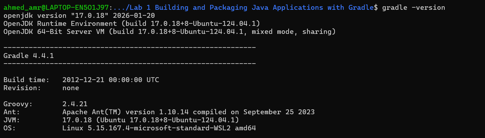
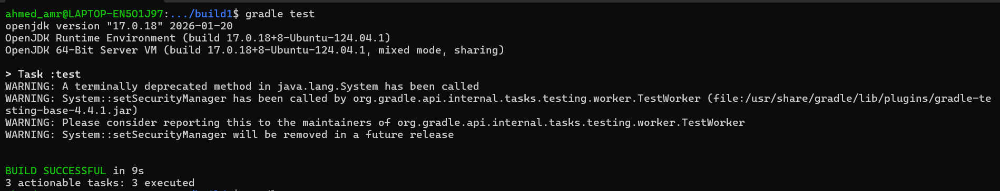
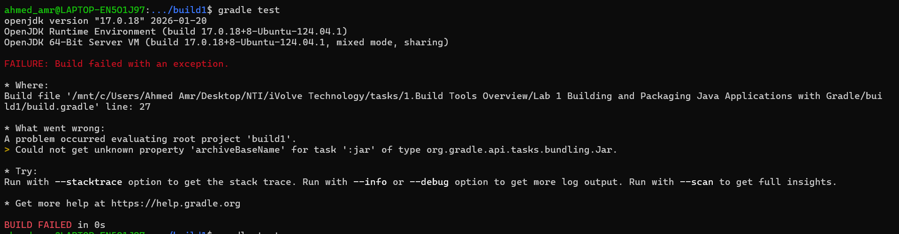
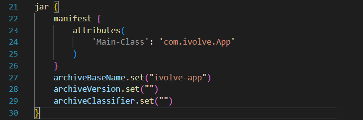
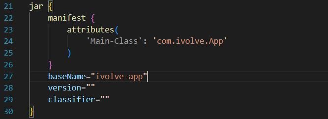
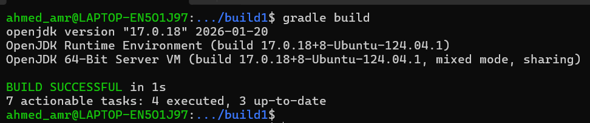
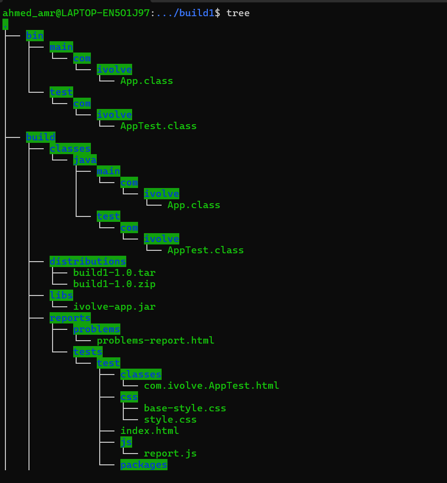

1. Install Gradle

```bash
sudo apt update
sudo apt install gradle -y
```

Verify installation:

```bash
gradle -version
```



2.Clone your application

```bash
git clone https://github.com/Ibrahim-Adel15/build1.git
```

3. Run Unit Tests

```bash
gradle test
```


-------------------------------------------------
DISCLAIMER: if you witnessed this error


change the following code in build.gradle



-------------------------------------------------

4. Build the Application

```bash
gradle build
```


To check run 
```bash
tree
```


5. Run the Application

```bash
java -jar build/libs/ivolve-app.jar
```
output shall be : Hello Ivolve Trainee

