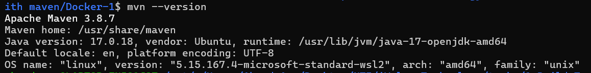
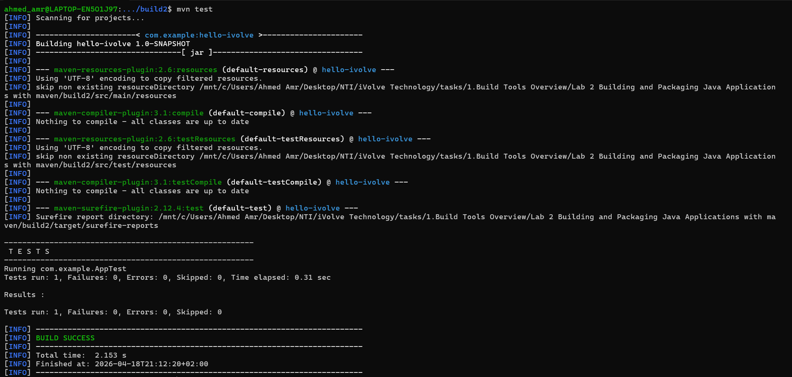
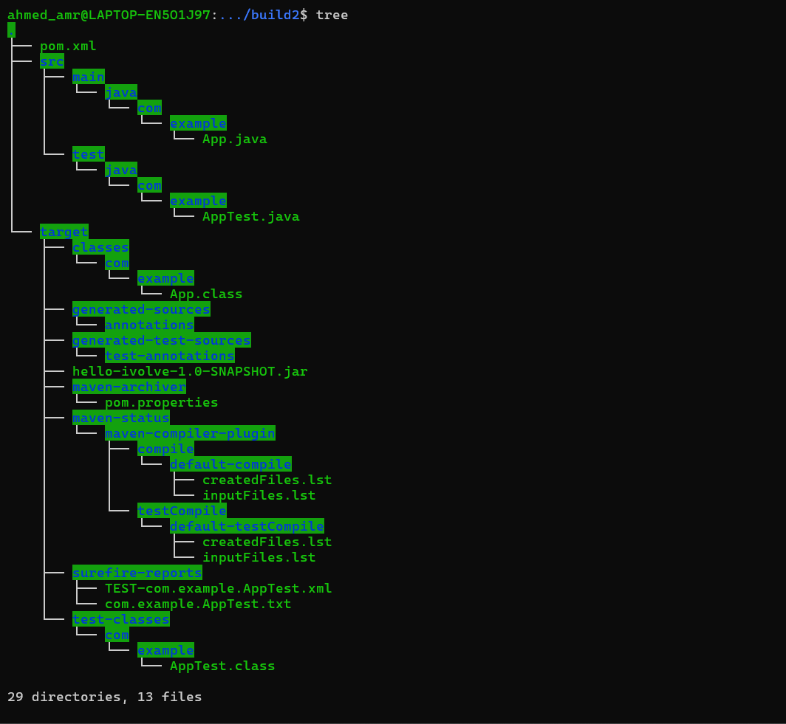
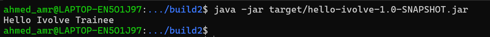

1. Install Maven

```bash
sudo apt update
sudo apt install maven -y
```

Verify installation:

```bash
mvn -version
```



2.Clone your application

```bash
git clone https://github.com/Ibrahim-Adel15/build2.git
```

3. Run Unit Tests

```bash
mvn test
```



4. Build the Application

```bash
mvn clean package
```
output: target/demo-0.0.1-SNAPSHOT.jar

To check run 
```bash
tree
```


5. Run the Application

```bash
java -jar /target/hello-ivolve-1.0-SNAPSHOT.jar
```
output shall be : Hello Ivolve Trainee

