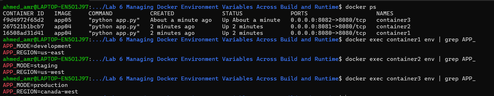

Clone repo 
```bash
git clone https://github.com/Ibrahim-Adel15/Docker-3.git
```

Write your docker file for app04 (environment variables not included)
```bash
cat <<EOF > Dockerfile
FROM python:3.12-slim

WORKDIR /app

COPY ./Docker-3 .

EXPOSE 8080

CMD ["python", "app.py"]
EOF
```

i.Passing environment variables as parameters in command

Build docker image from dockerfile
```bash
docker build -t app04 .
```
Run docker container from app01 image 
```bash
docker run -d -p 8080:8080 \
    --name container1 app04 \
    -e APP_MODE=development \ 
    -e APP_REGION=us-east
```

ii.Passing environment variables as file in command

Run docker container from app01 image 
```bash
docker run -d -p 8081:8080 \
    --name container2 \
    --env-file=.env app04
```

iii.Passing environment variables in docker file

Write your docker file for app05 (environment variables not included)
```bash
cat <<EOF > Dockerfile
FROM python:3.12-slim

WORKDIR /app

COPY ./Docker-3 .

EXPOSE 8080

ENV APP_MODE=production
ENV APP_REGION=canada-west

CMD ["python", "app.py"]
EOF
```

Build docker image from dockerfile
```bash
docker build -t app05 .
```

Run docker container from app01 image 
```bash
docker run -d -p 8082:8080 \
    --name container3 app05
```


