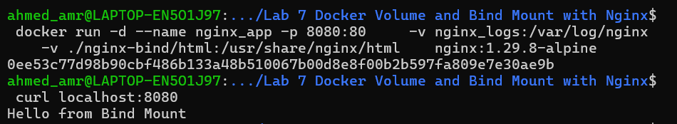
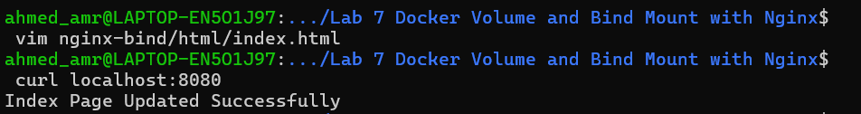
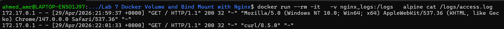

Creating a Docker Volume called nginx_logs
```bash
docker volume create nginx_logs
```

Creating index.html file in nginx-bind/html path
```bash
mkdir nginx-bind
mkdir nginx-bind/html
cat <<EOF > nginx-bind/html/index.html
Hello from Bind Mount
EOF
```

Running nginx container , using volume created above , binding mount for the directory created above

```bash
docker run -d --name nginx_app -p 8080:80 \
    -v nginx_logs:/var/log/nginx \
    -v ./nginx-bind/html/:/usr/share/nginx/html \
    nginx:1.29.8-alpine 
```


Verifying nginx page is running on host machine
```bash
curl http://localhost:8080
``` 



Change in the index.html file in your local machine then verify Nginx page again


Running an alpine container for listing logs on the volume & printing access.log 
```shell
docker run --rm -it \
  -v nginx_logs:/logs \
  alpine ls /logs
```

```shell
docker run --rm -it \
  -v nginx_logs:/logs \
  alpine cat /logs/access.log
```



--------------------------------------------------------------
NOTE: if you got stuck when printing access.log or error.log
run
```bash
docker exec -it nginx_app ls -l /var/log/nginx
```
if the output show a links for these files
```text
access.log -> /dev/stdout
error.log -> /dev/stderr
```
then recreate the nginx container with this command
```bash
docker run -d --name nginx_app -p 8080:80 \
    -v nginx_logs:/var/log/nginx \
    -v ./nginx-bind/html/:/usr/share/nginx/html \
    nginx:1.29.8-alpine sh -c \
  "rm /var/log/nginx/access.log /var/log/nginx/error.log && \
   touch /var/log/nginx/access.log /var/log/nginx/error.log && \
   nginx -g 'daemon off;'"
```