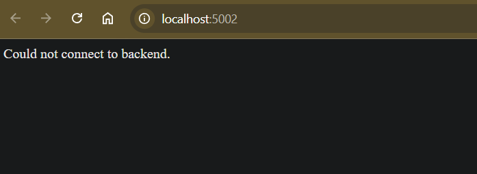

Clone frontend and backend code
```bash
git clone https://github.com/Ibrahim-Adel15/Docker5.git
```

Write Dockerfile for frontend
```bash
vim frontend/Dockerfile
```
```Dockerfile
FROM python:3.12-slim
WORKDIR /app
COPY . .
RUN pip install --upgrade pip
RUN pip install -r requirements.txt
EXPOSE 5000
CMD ["python","app.py"]
```

Build Image for frontend
```bash
docker build -t frontend Docker5/frontend
```

Write Dockerfile for Backend
```bash
vim backend/Dockerfile
```
```Dockerfile
FROM python:3.12-slim
WORKDIR /app
COPY . .
RUN pip install --upgrade pip
RUN pip install flask
EXPOSE 5000
CMD ["python","app.py"]
```

Build Image for Backend
```bash
docker build -t backend Docker5/backend
```

Create a new network called ivolve-network.
```bash
docker network create ivolve-network
```

 Run backend,frontend1 containers using ivolve-network, And running frontend2 container using default network
```bash
docker run -d --name backend  --network ivolve-network backend:latest
docker run -d --name frontend1 -p 5001:5000 --network ivolve-network frontend:latest
docker run -d --name frontend2 -p 5002:5000 frontend:latest
```
Verify the communication between containers.

Frontend1 can reach backend as they are on same network


Frontend2 can't reach backend as they are on different networks


Stop & Remove Container ,Then Remove Network
```bash
docker container stop backend frontend1 frontend2
docker container rm backend frontend1 frontend2
docker network rm ivole-network
```
